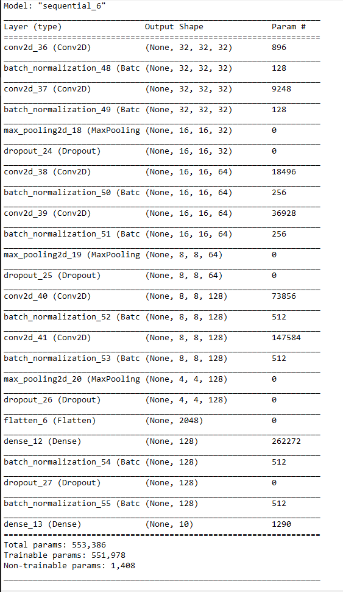
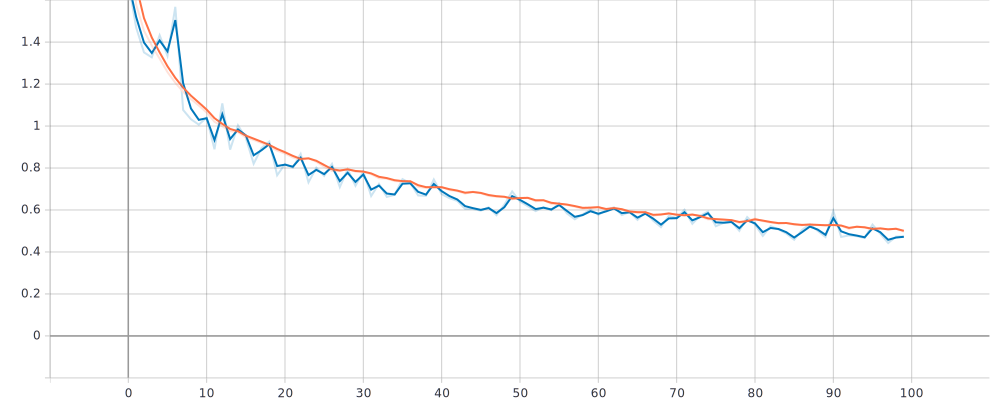
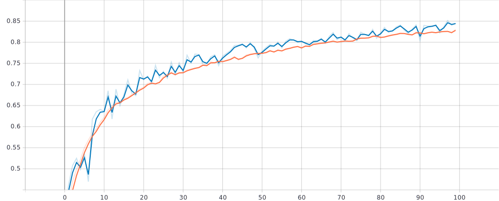
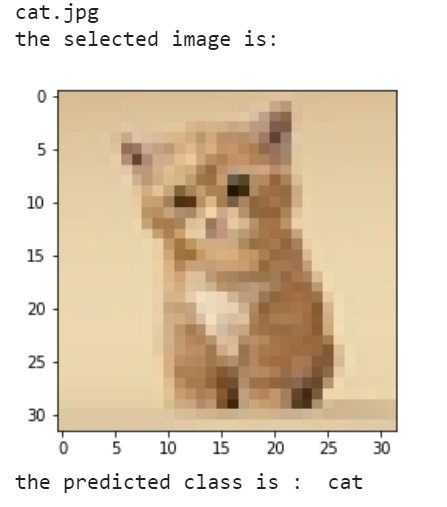
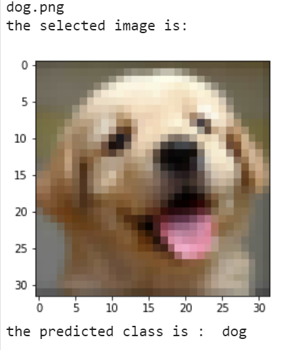
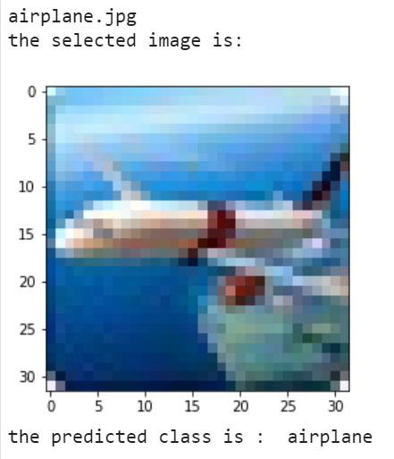

# Image Classification Model trained on CIFAR-10 Dataset
This is a model to classify the images present in the [CIFAR-10 Dataset](http://www.cs.toronto.edu/~kriz/cifar.html). The dataset consists of various images of animals and objects like cats, dogs, ships etc. all of which are of 32 x 32 pixels in size. the model is developed using the Keras API of the Tensorflow framework.

# Content
##### 1. The Dataset
##### 2. Model Architecture
##### 3. Making predictions

# 1. The Dataset
The CIFAR-10 dataset consists of 50000 training images and 10000 testing images along with their labels ranging from 0-9 to denote their class. Here I have used the inbuilt keras function to load the dataset and split it into training and testing sets. After that the data has to normalized such that the values of each entry is between 0-1. The labels have to be one hot encoded to make predictions possible. Then we train the model using the Training set.

# 2. Model architecture
The model used is a Convolution Neural network with the following structure:

After training the model the final accuracy achieved was ~85%. The following plots show the classification loss and accuracy the training (green line) and testing (red line) data respectively.

Epoch loss:

Epoch accuracy:

# 3. Making Predictions
Using the final model, predictions on sample images not belonging to the dataset could be achieved with considerable accuracy, below are some examples:

